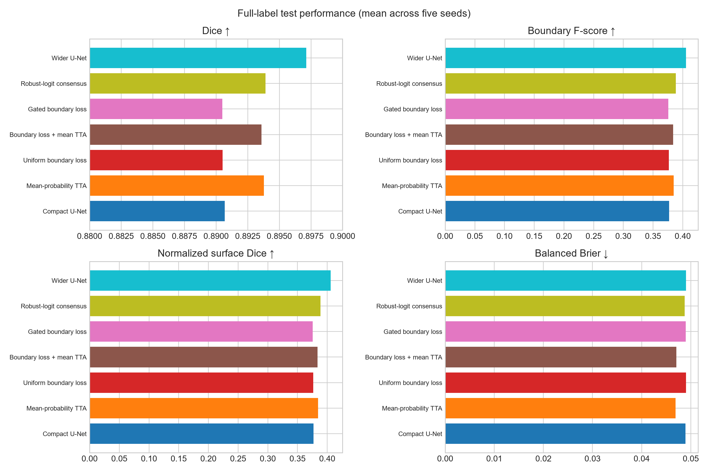

# Loss vùng biên hay gộp nhiều dự đoán? Nghiên cứu phân đoạn tổn thương da ISIC 2016 với năm seed

## Tóm tắt

Nghiên cứu này kiểm tra hai hướng cải tiến cho U-Net gọn nhẹ khi có ít ảnh được đánh dấu từng pixel: thêm loss để mô hình chú ý đường biên và chạy một ảnh theo bốn hướng rồi gộp kết quả lúc kiểm thử. Sau khi loại bốn ảnh bị trùng giữa các tập, thí nghiệm có 716 ảnh làm nguồn huấn luyện, 180 ảnh để chọn mô hình và 379 ảnh test. Ba mức huấn luyện dùng 179 ảnh (25%), 358 ảnh (50%) và 716 ảnh (100%). Bảy cách làm được chạy ở kích thước 256 × 256 với năm seed giống nhau, tổng cộng 105 lượt đánh giá. U-Net cơ sở đạt Dice 0,8444 ± 0,0095; 0,8688 ± 0,0051; và 0,8907 ± 0,0041 ở ba mức dữ liệu. Cách gộp robust-logit tăng Dice 0,0057; 0,0039; và 0,0032. U-Net rộng hơn cho kết quả cao nhất: 0,8555; 0,8785; và 0,8971. Hai cách thêm loss vùng biên đều thấp hơn mô hình cơ sở một lượng rất nhỏ. Với năm seed, kiểm định Wilcoxon hai phía chưa thể cho p < 0,05; vì vậy nghiên cứu mô tả mức chênh lệch thay vì khẳng định phương pháp nào luôn tốt hơn. Kết quả cho thấy gộp nhiều dự đoán và tăng vừa phải độ rộng mô hình có ích hơn hai loss vùng biên đã thử. Đây là mức khớp với mặt nạ tham chiếu trên bộ dữ liệu này, không phải bằng chứng về khả năng chẩn đoán hay dùng trong bệnh viện.

**Từ khóa:** xử lý ảnh y khoa; phân đoạn ảnh; tổn thương da; U-Net; ít ảnh được đánh dấu; loss vùng biên; TTA

## 1. Giới thiệu

Phân đoạn tổn thương da là xác định pixel nào trong ảnh soi da thuộc vùng tổn thương. Đường viền có thể khó thấy vì độ tương phản thấp, lông tóc, ánh sáng không đều, nhiễu từ thiết bị và hình dạng phức tạp. Việc vẽ mặt nạ chi tiết cũng tốn thời gian của người có chuyên môn. Vì vậy, một câu hỏi thực tế là làm sao tận dụng tốt lượng ảnh đã được đánh dấu còn hạn chế.

U-Net và các mạng encoder–decoder tương tự thường được dùng làm mốc so sánh [siddique2021unet; azad2022medical]. Có hai cách cải tiến tương đối rẻ. Cách thứ nhất thêm loss vùng biên để phạt rõ hơn khi mô hình vẽ sai đường viền [jurdi2021highlevel]. Cách thứ hai là TTA: lật hoặc xoay cùng một ảnh, dự đoán từng bản, đưa kết quả về cùng chiều rồi gộp lại [ashraf2022melanoma]. Mức khác nhau giữa các bản dự đoán cho biết mô hình nhạy với phép biến đổi đến đâu, nhưng không nên tự động gọi đó là độ không chắc chắn đã được kiểm chứng [abdar2021review; mehrtash2020confidence].

Nghiên cứu trả lời ba câu hỏi: loss vùng biên có giúp U-Net gọn nhẹ không; gộp bốn dự đoán có giúp không; và hai hướng đó có tốt hơn một U-Net rộng hơn nhưng chỉ dự đoán một lần không.

## 2. Dữ liệu và cách làm

### 2.1 Dữ liệu và kiểm tra trùng

Chương trình tải các cặp ảnh–mặt nạ ISIC 2016 từ `MedOtter/ISIC2016`. Trong 900 ảnh nguồn dùng để phát triển mô hình, 180 ảnh được chọn cố định làm tập validation bằng thứ tự băm SHA-256 của mã ảnh; 720 ảnh còn lại ban đầu là nguồn huấn luyện. Tập test có 379 ảnh. Chương trình băm nội dung từng tệp và phát hiện bốn ảnh huấn luyện trùng hoàn toàn với ảnh ở tập khác. Bốn ảnh này bị loại, còn 716 ảnh huấn luyện, 180 ảnh validation và 379 ảnh test. Repo không chứa các tệp ảnh.

Với mỗi seed, ảnh huấn luyện được chia nhóm theo tỷ lệ diện tích tổn thương. Ba mức 25%, 50% và 100% dùng 179, 358 và 716 ảnh. Tập nhỏ nằm trong tập lớn để so sánh công bằng. Trong cùng một seed và mức dữ liệu, mọi phương pháp dùng đúng cùng danh sách ảnh và cùng lịch tăng cường dữ liệu. Ảnh và mặt nạ được đưa về 256 × 256 pixel. Dữ liệu đã chuẩn bị không có mã bệnh nhân phù hợp nên chưa thể kiểm tra chắc rằng không có cùng một người ở nhiều tập. Đây là một hạn chế quan trọng [cassidy2021analysis; wen2021characteristics].

### 2.2 Mô hình và huấn luyện

U-Net gọn nhẹ có bốn mức kênh 16/32/64/128, dùng các khối tích chập tách theo chiều sâu, group normalization, SiLU, max pooling, phóng to bilinear và nối tắt giữa encoder với decoder. Mô hình có 62.716 tham số học được. U-Net rộng hơn dùng các mức 24/48/96/192 và có 134.572 tham số.

Loss cơ sở là binary cross-entropy cộng soft Dice. Bản UDB thêm loss dựa trên khoảng cách có dấu tới mặt nạ thật; khoảng cách bị chặn ở 20 pixel, hệ số là 0,01 và tăng dần trong mười epoch đầu. Bản UGDB còn giảm trọng số ở những nơi bốn bản dự đoán sau khi căn chỉnh khác nhau nhiều. Đại lượng này được gọi là độ nhạy với phép biến đổi, không gọi là độ không chắc chắn về kiến thức của mô hình.

Mô hình được huấn luyện bằng AdamW, learning rate 3×10⁻⁴, weight decay 10⁻⁴, batch 24, gradient clipping 1,0 và bfloat16 trên GPU. Mỗi lượt chạy tối đa 60 epoch. Chương trình kiểm tra validation sau mỗi hai epoch và dừng sớm nếu năm lần liên tiếp không tốt hơn. Ảnh được lật ngang, lật dọc, xoay theo bội số 90 độ và đổi nhẹ độ sáng/tương phản.

### 2.3 Bảy cấu hình

1. **C-UNet:** U-Net gọn nhẹ, dự đoán một lần.
2. **MP-TTA:** C-UNet dự đoán bốn hướng rồi lấy trung bình xác suất.
3. **UDB:** C-UNet có thêm loss khoảng cách tới đường biên.
4. **UDB+TTA:** UDB kết hợp TTA lấy trung bình xác suất.
5. **UGDB:** loss vùng biên được điều chỉnh bằng độ nhạy với phép biến đổi.
6. **RL-TTA:** C-UNet dự đoán bốn hướng; tại mỗi pixel, loại bản lệch nhiều nhất rồi lấy trung bình ba logit còn lại.
7. **W-UNet:** U-Net rộng hơn, dự đoán một lần.

Chỉ số chính là Dice trung bình trên từng ảnh ở ngưỡng 0,5. Nghiên cứu còn đo IoU, boundary F-score, normalized surface Dice, HD95 và các chỉ số về xác suất. Cần xem nhiều chỉ số vì một con số không thể mô tả hết lỗi phân đoạn [muller2022guideline; maierhein2024metrics].

Mỗi cấu hình chạy với năm seed. Bảng ghi trung bình và độ lệch chuẩn mẫu. Chênh lệch Dice được tính theo từng cặp seed, kiểm tra bằng Wilcoxon hai phía và bootstrap 20.000 lần. Với năm cặp số khác 0, p nhỏ nhất mà Wilcoxon hai phía có thể đạt là 0,0625. Vì vậy thí nghiệm phù hợp để ước lượng mức cải thiện hơn là đưa ra kết luận thống kê cuối cùng.

## 3. Kết quả

Cả 105 lượt đánh giá đều thành công. Tổng thời gian là 9,73 giờ trên NVIDIA RTX 4050 Laptop GPU; không có lỗi số học và không chạm giới hạn thời gian.

| Phương pháp | 25% (179 ảnh) | 50% (358 ảnh) | 100% (716 ảnh) |
|---|---:|---:|---:|
| C-UNet | 0,8444 ± 0,0095 | 0,8688 ± 0,0051 | 0,8907 ± 0,0041 |
| MP-TTA | 0,8492 ± 0,0102 | 0,8723 ± 0,0056 | 0,8938 ± 0,0048 |
| UDB | 0,8440 ± 0,0096 | 0,8686 ± 0,0053 | 0,8905 ± 0,0040 |
| UDB+TTA | 0,8488 ± 0,0104 | 0,8721 ± 0,0059 | 0,8936 ± 0,0048 |
| UGDB | 0,8437 ± 0,0097 | 0,8686 ± 0,0052 | 0,8905 ± 0,0042 |
| RL-TTA | 0,8500 ± 0,0100 | 0,8726 ± 0,0057 | 0,8939 ± 0,0047 |
| W-UNet | **0,8555 ± 0,0085** | **0,8785 ± 0,0056** | **0,8971 ± 0,0029** |

RL-TTA cao hơn C-UNet 0,0057 Dice khi dùng 25% dữ liệu, 0,0039 khi dùng 50% và 0,0032 khi dùng toàn bộ dữ liệu. MP-TTA cũng tăng 0,0048; 0,0036; và 0,0031. Lợi ích nhỏ dần khi có nhiều ảnh huấn luyện hơn, cho thấy TTA hữu ích nhất lúc dự đoán còn kém ổn định.

W-UNet đứng đầu ở cả ba mức và hơn C-UNet 0,0111; 0,0097; và 0,0065 Dice. Ngược lại, UDB thấp hơn mô hình cơ sở khoảng 0,0002–0,0004; UGDB thấp hơn khoảng 0,0002–0,0007. UDB+TTA tốt hơn C-UNet, nhưng gần như toàn bộ phần tăng đó cũng xuất hiện khi áp dụng TTA cho C-UNet không có loss vùng biên.

Không so sánh nào có p < 0,05. Điều này chủ yếu do kiểm định hai phía với năm cặp có độ phân giải thấp. Khoảng bootstrap dương mô tả kết quả đã quan sát; nó chưa đủ để khẳng định hiệu quả sẽ giữ nguyên trên dữ liệu khác.

Thứ tự các phương pháp khá giống nhau ở IoU và một số chỉ số bề mặt. Tuy vậy, boundary F-score và normalized surface Dice thấp hơn nhiều so với Dice vùng, nghĩa là mặt nạ có thể trùng khá tốt về diện tích nhưng đường viền vẫn chưa chính xác. Toàn bộ số liệu theo seed nằm trong `results/per_seed_metrics.csv`; bảng trung bình nằm trong `results/summary_metrics.csv`.

Không nên lấy Brier score hoặc ECE của một tập test nội bộ để nói rằng mô hình đã đáng tin cậy trong bệnh viện. Brier score trộn cả khả năng phân biệt và độ đúng của xác suất; ECE thay đổi theo cách chia nhóm; cả hai có thể đổi khi nguồn ảnh hoặc nhóm người bệnh thay đổi [mehrtash2020confidence; karimi2022improving].

## 4. Bàn luận

Điều giúp nhiều nhất là có thêm ảnh được vẽ mặt nạ. C-UNet tăng 0,0463 Dice khi đi từ 25% lên 100% dữ liệu. Trong các thay đổi về phương pháp, U-Net rộng hơn cho kết quả tốt nhất dù số tham số chỉ khoảng gấp đôi. TTA đem lại mức tăng nhỏ hơn nhưng rất đều giữa các seed và không cần huấn luyện lại; đổi lại, nó phải chạy mô hình khoảng bốn lần cho mỗi ảnh.

RL-TTA luôn nhỉnh hơn MP-TTA, nhưng chỉ hơn 0,0008; 0,0003; và 0,0001 Dice. Chênh lệch nhỏ như vậy chưa đủ để nói robust-logit chắc chắn tốt hơn. Khi triển khai, cần cân nhắc thêm thời gian chạy, điện năng và độ ổn định.

Hai loss vùng biên không đem lại lợi ích. Có thể soft Dice đã cung cấp đủ tín hiệu về hình dạng; hệ số 0,01 quá nhỏ; cách chuẩn hóa chưa phù hợp; hoặc mặt nạ sau khi đổi về 256 × 256 làm bài toán đường biên dễ hơn. Nghiên cứu tiếp theo nên đo độ lớn gradient của từng phần loss và chọn hệ số trên validation.

Đối chứng W-UNet làm thay đổi kết luận kỹ thuật. Nếu chỉ so các bản của mô hình gọn nhẹ, TTA sẽ đứng đầu. Khi thêm mô hình rộng hơn, thay đổi đơn giản về số kênh lại cho kết quả cao hơn mà chỉ cần dự đoán một lần.

## 5. Hạn chế

Nghiên cứu chỉ dùng một bộ dữ liệu và một cách chia validation cố định. Chưa kiểm tra được việc tách theo bệnh nhân. Ảnh bị đổi về 256 × 256 nên mất chi tiết nhỏ. Năm seed vẫn ít và các tập con có quan hệ lồng nhau. Hệ số loss vùng biên và tham số gate chưa được tìm kiếm rộng. Chưa có bộ dữ liệu ngoài, phân tích theo nhóm người bệnh, đánh giá của bác sĩ, kiểm tra khi nguồn ảnh thay đổi hay nghiên cứu tiến cứu. Kết quả chỉ đo độ khớp với mặt nạ tham chiếu; nó không đo khả năng phát hiện ung thư, đưa ra chẩn đoán, chọn điều trị hay mức an toàn thực tế.

## 6. Kết luận

Trên 105 lượt chạy với ISIC 2016, TTA bốn hướng giúp U-Net gọn nhẹ tăng khoảng 0,003–0,006 Dice. U-Net rộng hơn vừa phải đạt Dice cao nhất ở cả ba mức dữ liệu. Hai cách thêm loss vùng biên không cải thiện kết quả. Với cấu hình đã thử, tăng vừa phải số kênh và gộp nhiều dự đoán có ích hơn loss vùng biên; tuy nhiên, thêm dữ liệu được vẽ mặt nạ vẫn tạo mức tăng lớn nhất. Cần lặp lại trên dữ liệu độc lập và với nhiều seed hơn trước khi khái quát kết luận.

## Thông tin chạy lại

Repo chứa đúng mã đã chạy, chương trình chuẩn bị dữ liệu, kết quả theo seed, bảng tổng hợp, script tạo biểu đồ và tài liệu tham khảo. Repo không chứa ảnh, môi trường Python, cache, file hệ thống hay mã AutoResearchClaw. Người dùng phải xem điều khoản nguồn dữ liệu trước khi tải hoặc chia sẻ ảnh.
