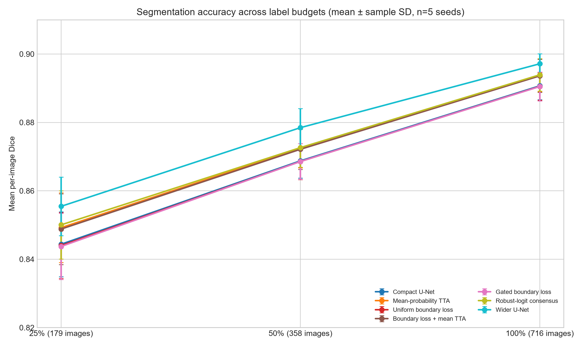
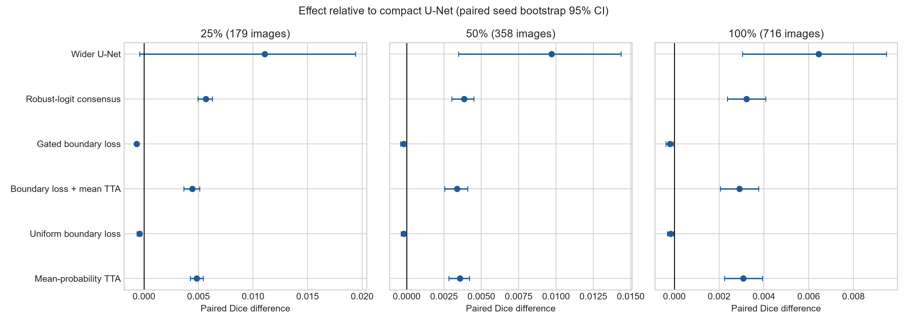

# Thuyết minh đề tài phân đoạn tổn thương da khi dữ liệu được vẽ mặt nạ còn hạn chế

## 1. Thông tin chung

| Nội dung | Mô tả |
|---|---|
| Tên đề tài | Đánh giá loss vùng biên và cách gộp nhiều dự đoán cho phân đoạn tổn thương da khi có ít ảnh được vẽ mặt nạ |
| Lĩnh vực | Xử lý ảnh y khoa và học sâu |
| Bài toán | Tự động xác định vùng tổn thương trên ảnh soi da |
| Bộ dữ liệu | ISIC 2016, lấy từ bản sao MedOtter/ISIC2016 |
| Quy mô sau khi lọc ảnh trùng | 716 ảnh huấn luyện, 180 ảnh để chọn mô hình và 379 ảnh test |
| Thiết lập chính | 256 × 256 pixel, ba mức dữ liệu, năm seed, tối đa 60 epoch |
| Trạng thái | Đã hoàn thành 105 trên 105 lượt đánh giá và công bố mã nguồn cùng số liệu |

## 2. Lý do chọn đề tài

Phân đoạn tổn thương da là việc xác định chính xác pixel nào thuộc vùng tổn thương trên ảnh soi da. Mặt nạ phân đoạn có thể hỗ trợ việc đo diện tích, hình dạng và đường viền của tổn thương. Tuy nhiên, để tạo một mặt nạ tốt, người có chuyên môn phải vẽ đường bao quanh tổn thương trên từng ảnh. Công việc này mất thời gian hơn nhiều so với việc chỉ gắn tên loại bệnh cho ảnh.

Ảnh soi da cũng có nhiều yếu tố gây khó cho mô hình. Lông tóc có thể che khuất vùng cần quan sát. Ánh sáng, màu da, loại máy chụp và độ tương phản thay đổi giữa các ảnh. Một số tổn thương có đường viền mờ hoặc hình dạng không đều. Vì vậy, nghiên cứu cần xem xét cả độ trùng vùng và độ chính xác của đường biên thay vì chỉ dùng một chỉ số.

Đề tài chọn hai hướng cải tiến không đòi hỏi mô hình quá lớn. Hướng thứ nhất thêm một phần loss để mô hình chú ý nhiều hơn tới vùng gần đường viền. Hướng thứ hai cho mô hình dự đoán cùng một ảnh theo nhiều hướng lật và xoay, sau đó gộp các kết quả. Hai hướng này được so sánh với một cách đơn giản hơn là tăng vừa phải số kênh của U-Net.

## 3. Mục tiêu nghiên cứu

### 3.1 Mục tiêu chính

Đánh giá bằng thực nghiệm xem loss vùng biên và cách gộp bốn dự đoán có giúp U-Net gọn nhẹ tạo mặt nạ tổn thương da chính xác hơn khi số ảnh huấn luyện bị giới hạn hay không.

### 3.2 Mục tiêu cụ thể

1. Chuẩn bị bộ dữ liệu ISIC 2016 có tập huấn luyện, tập dùng để chọn mô hình và tập test tách riêng.
2. Kiểm tra và loại ảnh bị trùng hoàn toàn giữa các tập để tránh kết quả cao giả tạo.
3. Xây dựng U-Net gọn nhẹ làm mốc so sánh.
4. Thử hai cách huấn luyện có thêm loss vùng biên.
5. Thử hai cách gộp dự đoán từ bốn hướng ảnh.
6. So sánh các cách trên với U-Net rộng hơn nhưng chỉ dự đoán một lần.
7. Đánh giá ở ba mức dữ liệu và lặp lại với năm seed để xem kết quả có ổn định hay không.

## 4. Câu hỏi nghiên cứu

1. Khi chỉ dùng 25% hoặc 50% ảnh huấn luyện, loss vùng biên có cải thiện Dice và chất lượng đường viền không?
2. Việc gộp bốn dự đoán ở lúc kiểm thử có giúp kết quả ổn định hơn một lần dự đoán thông thường không?
3. Cách gộp robust-logit có tốt hơn cách lấy trung bình xác suất đơn giản không?
4. Các cải tiến trên có cạnh tranh được với một U-Net rộng hơn nhưng vẫn khá nhẹ không?
5. Lợi ích của từng phương pháp thay đổi như thế nào khi số ảnh huấn luyện tăng từ 179 lên 716 ảnh?

## 5. Dữ liệu và phạm vi

Chương trình chuẩn bị dữ liệu đọc các cặp ảnh và mặt nạ từ `MedOtter/ISIC2016`. Nguồn ban đầu có 900 ảnh trong phần dùng để phát triển mô hình. Chương trình chọn cố định 180 ảnh làm tập validation bằng thứ tự băm SHA-256 của mã ảnh. Tập test có 379 ảnh.

Sau đó, nội dung từng tệp ảnh được băm để tìm các ảnh trùng hoàn toàn. Bốn ảnh trong nguồn huấn luyện bị trùng với ảnh ở tập khác và được loại bỏ. Quy mô cuối cùng là 716 ảnh huấn luyện, 180 ảnh validation và 379 ảnh test. Tập test chỉ được dùng sau khi mô hình và các tham số cần chọn đã được quyết định.

Ba mức dữ liệu huấn luyện gồm 179 ảnh, 358 ảnh và 716 ảnh, tương ứng 25%, 50% và 100% nguồn huấn luyện. Trong mỗi seed, tập 25% nằm trong tập 50%, và tập 50% nằm trong tập 100%. Các ảnh được chia nhóm theo tỷ lệ diện tích tổn thương trước khi lấy mẫu để tránh việc một tập con tình cờ chứa toàn tổn thương quá lớn hoặc quá nhỏ.

Phạm vi của đề tài chỉ là phân đoạn vùng tổn thương theo mặt nạ tham chiếu. Đề tài không dự đoán loại bệnh, không xác định ung thư, không đưa ra chẩn đoán và không đánh giá hiệu quả điều trị.

## 6. Phương pháp

### 6.1 Mô hình làm mốc

Mô hình cơ sở là U-Net bốn mức với số kênh 16, 32, 64 và 128. Mạng dùng tích chập tách theo chiều sâu để giảm số phép tính, group normalization, hàm SiLU, max pooling, phóng to bilinear và các đường nối tắt giữa phần mã hóa với phần giải mã. Mô hình có 62.716 tham số học được.

Loss cơ sở gồm binary cross-entropy cộng với soft Dice. Binary cross-entropy giúp từng pixel được phân thành nền hoặc tổn thương. Soft Dice đo mức trùng nhau của toàn vùng dự đoán với mặt nạ thật và giảm ảnh hưởng của việc số pixel nền nhiều hơn số pixel tổn thương.

### 6.2 Loss vùng biên

Phiên bản UDB thêm một phần loss dựa trên khoảng cách có dấu từ từng pixel tới mặt nạ thật. Pixel ở trong tổn thương nhận khoảng cách âm, pixel ở ngoài nhận khoảng cách dương. Giá trị khoảng cách được giới hạn trong 20 pixel để những điểm quá xa đường biên không chi phối loss. Hệ số của phần loss này là 0,01 và tăng dần trong mười epoch đầu.

Phiên bản UGDB còn dùng độ khác nhau giữa bốn dự đoán đã được đưa về cùng chiều. Nếu bốn dự đoán khác nhau nhiều ở một vùng, trọng số loss biên tại đó được giảm. Trong báo cáo này, đại lượng đó được gọi là độ nhạy với phép biến đổi, không gọi là độ không chắc chắn đã được kiểm chứng.

### 6.3 Gộp nhiều dự đoán lúc kiểm thử

Bốn góc nhìn gồm ảnh gốc, lật ngang, lật dọc và xoay 180 độ. Mỗi mặt nạ dự đoán được đưa về đúng chiều trước khi gộp.

MP-TTA lấy trung bình bốn bản xác suất. RL-TTA làm việc trên logit. Tại mỗi pixel, phương pháp tìm bản dự đoán lệch nhiều nhất so với mức trung vị trong cửa sổ 5 × 5, loại bản đó rồi lấy trung bình ba logit còn lại. Cách này được thiết kế để giảm ảnh hưởng của một góc nhìn bất thường.

### 6.4 Mô hình rộng hơn

W-UNet dùng số kênh 24, 48, 96 và 192, có 134.572 tham số. Mô hình này chỉ dự đoán một lần. Nó giúp trả lời một câu hỏi thực tế: thay vì chạy U-Net nhỏ bốn lần, có thể chỉ cần tăng vừa phải độ rộng của mạng hay không?

### 6.5 Cách huấn luyện

Mỗi mô hình được huấn luyện bằng AdamW với learning rate 0,0003, weight decay 0,0001, batch 24 và tối đa 60 epoch. Gradient được giới hạn ở 1,0. Chương trình dùng bfloat16 trên GPU và kiểm tra tập validation sau mỗi hai epoch. Nếu năm lần kiểm tra liên tiếp không tốt hơn, quá trình huấn luyện có thể dừng sớm.

Ảnh huấn luyện được lật ngang, lật dọc, xoay theo bội số 90 độ và đổi nhẹ độ sáng hoặc độ tương phản. Mỗi phương pháp trong cùng một seed dùng cùng danh sách ảnh, điểm khởi tạo và lịch tăng cường dữ liệu để việc so sánh công bằng hơn.

## 7. Thiết kế thí nghiệm

Bảy cấu hình được chạy ở ba mức dữ liệu và năm seed, tạo ra 105 lượt đánh giá.

| Ký hiệu | Cách huấn luyện | Cách dự đoán |
|---|---|---|
| C-UNet | BCE cộng soft Dice | Một lần dự đoán |
| MP-TTA | Giống C-UNet | Trung bình xác suất của bốn hướng |
| UDB | Thêm loss khoảng cách vùng biên | Một lần dự đoán |
| UDB+TTA | Giống UDB | Trung bình xác suất của bốn hướng |
| UGDB | Loss biên có trọng số theo độ nhạy với phép biến đổi | Một lần dự đoán |
| RL-TTA | Giống C-UNet | Gộp ba trong bốn logit sau khi loại bản lệch nhất |
| W-UNet | U-Net rộng hơn với BCE cộng soft Dice | Một lần dự đoán |

Chỉ số chính là Dice trung bình trên từng ảnh. Dice bằng 1 khi hai mặt nạ trùng hoàn toàn và giảm khi vùng dự đoán lệch khỏi mặt nạ thật. Các chỉ số phụ gồm IoU, boundary F-score, normalized surface Dice, HD95, Brier score, negative log-likelihood và expected calibration error.

Kết quả được báo cáo bằng trung bình và độ lệch chuẩn mẫu qua năm seed. Mỗi phương pháp được so với C-UNet theo đúng từng seed bằng kiểm định Wilcoxon hai phía và bootstrap 20.000 lần. Với chỉ năm cặp, p nhỏ nhất của Wilcoxon hai phía là 0,0625. Vì vậy, các phép tính này dùng để mô tả mức chênh lệch, chưa đủ cho một kết luận thống kê mạnh.

## 8. Kết quả thực nghiệm

Cả 105 lượt đánh giá đều hoàn thành. Tổng thời gian đo được là 9,73 giờ trên NVIDIA RTX 4050 Laptop GPU. Không có lượt chạy nào bị lỗi số học hoặc dừng vì vượt giới hạn thời gian.

| Phương pháp | 25% dữ liệu | 50% dữ liệu | 100% dữ liệu |
|---|---:|---:|---:|
| C-UNet | 0,8444 ± 0,0095 | 0,8688 ± 0,0051 | 0,8907 ± 0,0041 |
| MP-TTA | 0,8492 ± 0,0102 | 0,8723 ± 0,0056 | 0,8938 ± 0,0048 |
| UDB | 0,8440 ± 0,0096 | 0,8686 ± 0,0053 | 0,8905 ± 0,0040 |
| UDB+TTA | 0,8488 ± 0,0104 | 0,8721 ± 0,0059 | 0,8936 ± 0,0048 |
| UGDB | 0,8437 ± 0,0097 | 0,8686 ± 0,0052 | 0,8905 ± 0,0042 |
| RL-TTA | 0,8500 ± 0,0100 | 0,8726 ± 0,0057 | 0,8939 ± 0,0047 |
| W-UNet | **0,8555 ± 0,0085** | **0,8785 ± 0,0056** | **0,8971 ± 0,0029** |

Kết quả cho thấy ba điểm chính. Thứ nhất, thêm dữ liệu tạo ra mức cải thiện lớn nhất. Dice của C-UNet tăng 0,0463 khi đi từ 25% lên 100% dữ liệu. Thứ hai, hai cách TTA đều giúp U-Net nhỏ. RL-TTA tăng lần lượt 0,0057; 0,0039; và 0,0032 Dice. Thứ ba, W-UNet đạt kết quả cao nhất ở cả ba mức dữ liệu, cao hơn C-UNet 0,0111; 0,0097; và 0,0065.

Hai loss vùng biên không cải thiện Dice. UDB thấp hơn C-UNet khoảng 0,0002 đến 0,0004; UGDB thấp hơn khoảng 0,0002 đến 0,0007. UDB+TTA tốt hơn C-UNet, nhưng mức tăng gần bằng việc dùng TTA trên C-UNet không có loss vùng biên. Điều này cho thấy phần cải thiện đến từ TTA chứ chưa có bằng chứng đến từ loss biên.

Không phép so sánh nào có p nhỏ hơn 0,05. Đây là giới hạn toán học dễ thấy khi chỉ có năm cặp seed. Việc cả năm seed của TTA cùng tăng vẫn là một dấu hiệu tích cực, nhưng chưa đủ để khẳng định phương pháp sẽ luôn tốt hơn trên dữ liệu khác.

## 9. Phân tích và ý nghĩa

Kết quả không ủng hộ giả thuyết ban đầu rằng loss vùng biên sẽ giúp rõ rệt khi có ít ảnh huấn luyện. Một khả năng là soft Dice đã cung cấp đủ thông tin về hình dạng. Hệ số 0,01 cũng có thể quá nhỏ, hoặc cách chuẩn hóa phần loss biên chưa phù hợp với loss chính. Nghiên cứu sau nên ghi lại độ lớn gradient của từng phần loss và chọn hệ số bằng tập validation.

TTA cho mức tăng nhỏ nhưng ổn định. Mức tăng giảm khi dữ liệu huấn luyện nhiều hơn, phù hợp với cách giải thích rằng gộp nhiều góc nhìn chủ yếu giúp giảm sai khác ngẫu nhiên của một mô hình còn chưa ổn định. Tuy nhiên, TTA phải chạy mạng bốn lần cho mỗi ảnh nên thời gian dự đoán tăng.

W-UNet là đối chứng quan trọng. Nếu chỉ so các phiên bản của U-Net nhỏ, RL-TTA sẽ đứng đầu. Khi thêm W-UNet, việc tăng vừa phải số kênh lại cho Dice cao hơn và chỉ cần dự đoán một lần. Vì vậy, lựa chọn thực tế nên cân nhắc cả độ chính xác, thời gian chạy, bộ nhớ và thiết bị sử dụng.

## 10. Điểm mới và đóng góp

1. Thí nghiệm so sánh loss vùng biên, hai cách TTA và một đối chứng tăng độ rộng trong cùng một quy trình.
2. Ba mức dữ liệu được lấy lồng nhau và mọi phương pháp dùng cùng seed, giúp giảm sai khác do cách chọn ảnh.
3. Chương trình kiểm tra ảnh trùng bằng nội dung tệp trước khi huấn luyện và loại bốn trường hợp có nguy cơ làm rò rỉ dữ liệu.
4. Toàn bộ 105 kết quả theo seed, chỉ số phụ, script phân tích và hình được công bố để người khác kiểm tra lại.
5. Nghiên cứu báo cáo cả kết quả không thuận lợi của loss vùng biên thay vì chỉ chọn phương pháp có số điểm cao.

## 11. Hạn chế

Nghiên cứu mới dùng một bộ dữ liệu và một cách chia validation cố định. Dữ liệu đã chuẩn bị không có mã bệnh nhân phù hợp nên chưa kiểm tra được việc tách theo người bệnh. Ảnh bị đổi về 256 × 256, có thể làm mất chi tiết nhỏ ở đường viền. Năm seed vẫn ít cho kiểm định thống kê. Hệ số loss biên và tham số gate chưa được tìm kiếm rộng. Chưa có bộ dữ liệu ngoài, đánh giá theo nhóm người bệnh, kiểm tra khi nguồn ảnh thay đổi hay nhận xét của bác sĩ.

## 12. Sản phẩm của đề tài

| Sản phẩm | Trạng thái |
|---|---|
| Mã chuẩn bị và kiểm tra dữ liệu | Đã hoàn thành |
| Mã huấn luyện và đánh giá bảy cấu hình | Đã hoàn thành |
| Kết quả đầy đủ của 105 lượt đánh giá | Đã công bố dạng JSON và CSV |
| Ba biểu đồ phục vụ bài báo | Đã hoàn thành |
| Paper tiếng Anh và tiếng Việt | Đã hoàn thành |
| Bản manuscript Word để gửi phản biện | Đã hoàn thành |
| Kho mã công khai | Đã cập nhật trên GitHub |

Kho mã công khai: `https://github.com/TuanAnhPhan-pika/Boundary-Aware-and-Test-Time-Consensus-for-Label-Limited-Skin-Lesion`

Repo không chứa dữ liệu ảnh, môi trường Python, cache, checkpoint, file hệ thống hay mã AutoResearchClaw.

## 13. Hướng phát triển

Nghiên cứu tiếp theo nên tăng số seed hoặc lặp lại với nhiều cách chọn tập con độc lập. Loss vùng biên cần được thử với nhiều hệ số và theo dõi trực tiếp gradient. Mô hình nên được đánh giá trên ảnh có độ phân giải cao hơn và trên một bộ dữ liệu ngoài ISIC 2016. Cuối cùng, cần kiểm tra tốc độ, bộ nhớ và mức tiêu thụ điện trên thiết bị mục tiêu trước khi chọn giữa W-UNet và TTA.

## 14. Kết luận

Trong thiết lập đã thử, TTA bốn hướng giúp U-Net gọn nhẹ tăng khoảng 0,003 đến 0,006 Dice. U-Net rộng hơn vừa phải đạt điểm cao nhất ở cả ba mức dữ liệu. Hai loss vùng biên không cải thiện kết quả. Thêm ảnh được vẽ mặt nạ vẫn đem lại mức tăng lớn nhất. Kết quả đủ để làm cơ sở cho một bài báo thực nghiệm về xử lý ảnh y khoa, nhưng chưa phải bằng chứng cho chẩn đoán hoặc sử dụng lâm sàng.
